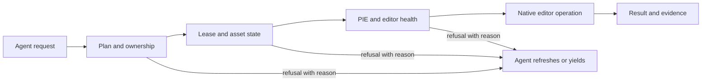

# Safety model for a shared editor

**Release status:** The protections below describe the `0.4.0` candidate. Final release gates and live checks are still in progress; see [versioning](VERSIONING.md) for the deploy sequence.

An Unreal Editor process is shared mutable state. Agents can issue commands serially and still make conflicting decisions from stale reads. Hayba therefore checks writes at the editor boundary, where it can see the actual editor state and the resource another agent holds.

## One write path, several checks

| Boundary | What it protects | What the agent should do on refusal |
| --- | --- | --- |
| **Plan and undo** | When Plan Mode is enabled, destructive commands require an approved plan. Native undo covers supported operations. | Review the proposed targets and scope before retrying. |
| **Owner-bound lease** | Another agent cannot quietly take over a resource already in use. Leases can be recovered after an interrupted owner. | Wait, refresh ownership, or use the documented adoption flow. |
| **Asset busy** | A build on one asset blocks conflicting work on that asset while independent assets can proceed. | Let the active build finish or choose independent work. |
| **PIE state** | Writes that would be unsafe or transient during Play are refused. A dirty, uncompiled Blueprint can also block Play before a modal compile-error dialog appears. | Stop Play or compile the Blueprint, then inspect state again. |
| **Editor health** | A contained native fault marks the editor unsafe and stops later writes, including remaining batch steps. | Stop automation and restart the scratch editor after diagnosis. |
| **Save path** | Read-only and changing-file-state errors return an error instead of forcing a blocking or crash-prone save path. Embedded Python is run unattended. | Resolve the file state and decide explicitly whether to save. |

Batch work is bounded and pauses at editor-state fences. Structured refusal codes tell an orchestrator what happened. They are a signal to reconsider the plan, not an invitation to resend the same write blindly.

Plan Mode defaults on for a new project but can be disabled in project settings. With it off, a destructive command such as `actor_transform` does not require plan approval. Owner-bound lease checks, PIE and editor-health guards still apply independently. Native transactions remain separate from Plan Mode and have operation, request and PIE exceptions; do not assume every edit has an undo record.

## Validator warnings require review

Validator findings carry stable `validator.warning_ids` in machine-readable results, including `errors_only` responses. Hayba Chat keeps a bounded review ledger across dispatch and restart. It labels warnings as **unreviewed**, **deferred**, or **acknowledged** without presenting a review as a fix; a fresh validation is needed to establish resolution. If the ledger overflows, Hayba requires complete, zero-warning UI validation of the originating widget and an explicit review before clearing the overflow state. A partial or disabled-rule run cannot clear it.

External MCP orchestrators must inspect `validator.warning_ids` and carry unresolved findings into their own reports. Hayba can supply the metadata but cannot control an external agent's final prose.

## What “multi-agent” means here

Hayba coordinates agents **sharing one editor process** through explicit ownership and resource checks. This is different from running several Unreal instances on separate ports: multi-instance discovery solves connection routing, while leases address conflicting edits in a shared instance. Safe reads remain available where the editor permits them, so an agent can inspect while another owns a resource without silently acquiring write authority.

This safety model reduces specific failure modes; it does not make arbitrary native code crash-proof or guarantee that every Unreal subsystem can be rolled back. A contained fault is treated as a reason to stop. When evidence is incomplete, the agent should report uncertainty and return control to the user.

The implementation is exercised with headless Unreal automation, scratch-project builds, Node tests, and live editor ladders. Manual observations are reported only after a person performs them. The [scratch-host safety guide](SAFETY-scratch-host-and-leases.md) and [ADRs](adr/) record the verification boundaries and decisions.
